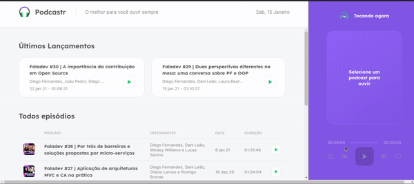

<h1 align="center"> NLW - NEXT LEVEL WEEK</h1>
<h3 align="center">Repositório destinado ao estudo da Next Level Week da RocketSeat. Contém as trilhas de NODEJS e REACT NATIVE</h3>

<h4>Este repositório contém:</h4> 
<h3 align="center">🚀🚀 NLW-5: 🚀🚀</h3> 

- <b><a href="https://github.com/pablolucas890/nlw/tree/main/nlw-5/nodejs">NodeJs (nlw-5)</a></b>    
- <b><a href="https://github.com/pablolucas890/nlw/tree/main/nlw-5/react-native">React Native (nlw-5)</a></b>  ||
- <b><a href="https://github.com/pablolucas890/nlw/tree/main/nlw-5/reactjs">ReactJs (nlw-5)</a></b>    
 

---

<h3 align="center">🚀🚀 NLW-6: 🚀🚀</h3> 

- <b><a href="https://github.com/pablolucas890/nlw/tree/main/nlw-6/react-native">React Native (nlw-6)</a></b>  ||

---

<h3 align="center">🚀🚀 NLW-10: 🚀🚀</h3> 

- <b><a href="https://github.com/pablolucas890/nlw/tree/main/nlw-10/mobile">Mobile (nlw-10)</a></b>  ||
---

- <b><a href="https://github.com/pablolucas890/nlw/tree/main/nlw-10/web">Web (nlw-10)</a></b>  
---

- <b><a href="https://github.com/pablolucas890/nlw/tree/main/nlw-10/server">Server (nlw-10)</a></b>  

