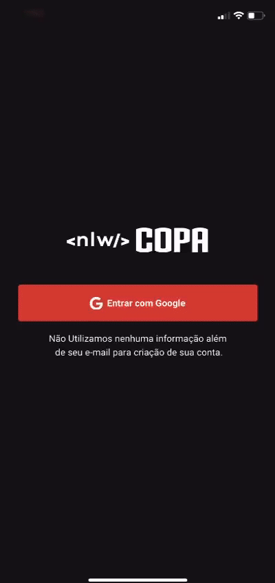

# Nlw Copa - Mobile



----------
## Notes

-  (Compoents with buttons, etc)
- npx expo install react-native-svg@12.1.1
- npx expo install react-native-safe-area-context
- install expo-fonts
- install react-native-svg-transformer
- configure file metro.config.js
- configure import svg files on src/@types/svg.d.ts
```
declare module "*.svg" {
    import React from 'react'
    import { SvgProps } from 'react-native-svg'
    const content: React.FC<SvgProps>
    export default content
}
```
- npx expo install expo-auth-session expo-random
- npx expo install expo-web-browser
- console.cloud.google.com
    - Novo Projeto
    - APIs e Serviços
    - configurar tela de permissão
    - Credenciais
    - Criar Credenciais
    - ID do Client OAuth
    - URI Autorizada https://auth.expo.io
    - URI Nao Autorizada
        - logar no expo no celular
        - logar no expo no terminal
        - npx expo login
        - https://auth.expo.io/@user/slug
    - pegar chave
-  npm i phosphor-react-native
-  npm install @react-navigation/native
-  npx expo install react-native-screens react-native-safe-area-context
-  npm install @react-navigation/bottom-tabs
-  npm install axios
----------
## Development
- `nvm use 16.16.0`
- `npm install`
- `npx expo login # logar no expo no celular e no terminal`
- `npm run start`