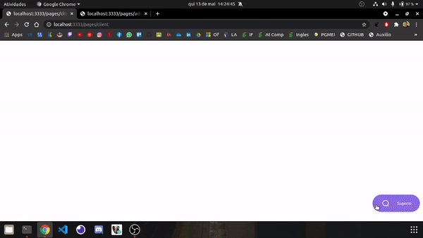

  
 
# Anotações
- TypeOrm com Sqlite
- yarn add typeorm reflect-metadata sqlite3
- configurar o ormconfig
- criar coxexao em src/database
- criar database
- importar database no server
- visualizar sqlite:
    - instalar extenção sqlite
    - ^ shift p 
    - caminho database
    - sqlite explorer
- yarn add socket.io
- yarn add @types/socket.io -D
- yarn add ejs
- yarn add socket.io-client
